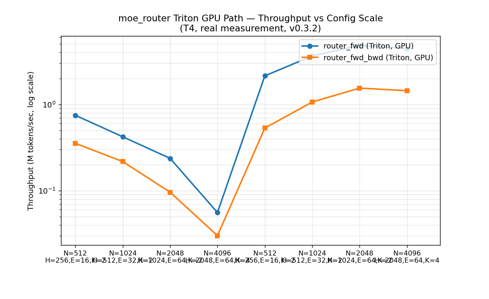
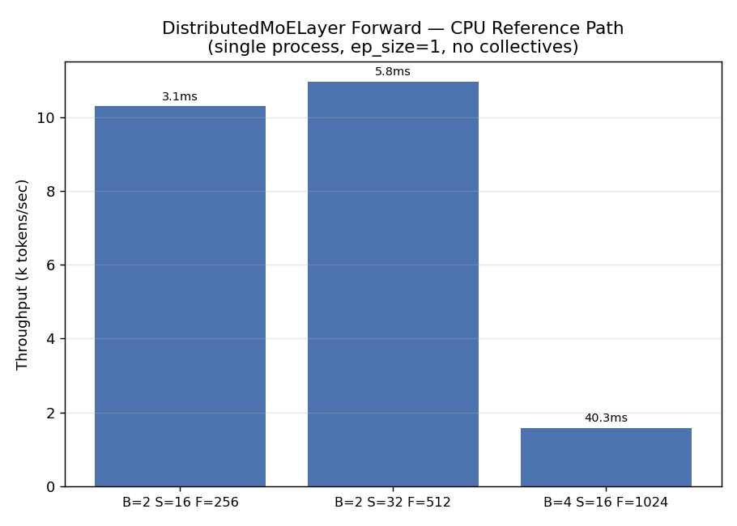
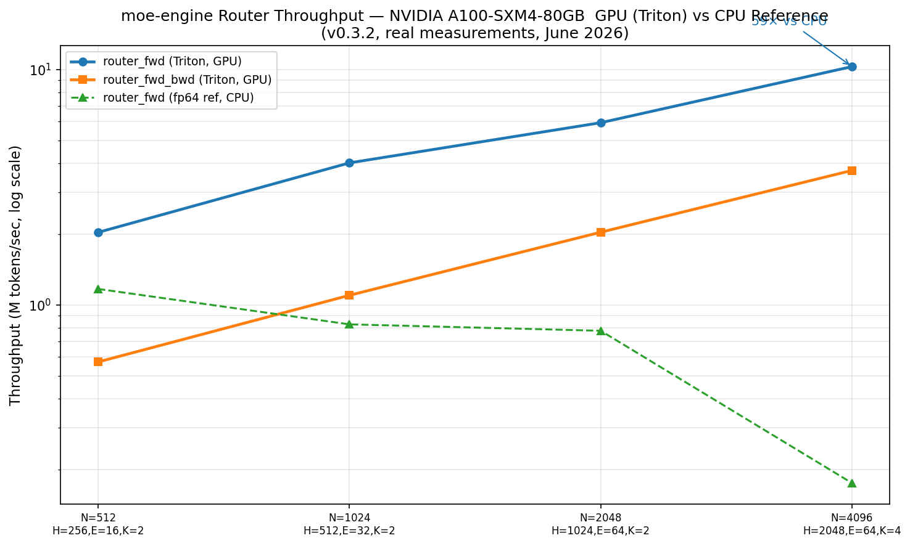

<div align="center">

# `moe-engine` · Composed Mixture-of-Experts Engine

**A research-grade fault-tolerant runtime for hyperscale Mixture-of-Experts training**

[](https://github.com/Mattral/Composed-Mixture-of-Experts-Engine/blob/main/LICENSE)
[](https://pytorch.org/)
[](https://triton-lang.org/)
[](https://github.com/Mattral/Composed-Mixture-of-Experts-Engine/blob/main/moe-engine/tests/)
[](docs/adr/ADR-005-gpu-architecture-portability.md)
[](https://github.com/Mattral/Composed-Mixture-of-Experts-Engine/blob/main/RESULTS.md#fault-tolerance--chaos-test-results)
[](https://github.com/Mattral/Composed-Mixture-of-Experts-Engine/pulls)
[](https://github.com/Mattral/Composed-Mixture-of-Experts-Engine/releases)

</div>

> **Associated Publication**  
> This repository is accompanied by the preprint:  
> **moe-engine: A Fault-Tolerant Runtime for Hyperscale Mixture-of-Experts Training**  
> Min Htet Myet, June 2026  
> [](https://doi.org/10.5281/zenodo.20688837)  
> [Read on Zenodo](https://zenodo.org/records/20688837) · [PDF](https://zenodo.org/records/20688837/files/moe-engine-preprint-v2.pdf)

> **v0.3.2 (June 2026)**: Fixed Triton kernel compile-time crash that prevented all real-GPU runs since v0.2 (undetected by CPU-only CI). Added real dense-baseline measurements. Fixed `train.py` config crash. See `benchmarks/BENCHMARKS.md` for full patch notes.

---

## What this is

`moe-engine` is a **research-grade infrastructure runtime** for training large Mixture-of-Experts (MoE) language models at hyperscale. It is designed around one realistic constraint: **at 10K+ GPUs, nodes die continuously**. The system must keep training alive end-to-end — routing tokens correctly, checkpointing durably to NVMe then S3, and recovering automatically with expert resharding, without operator intervention.

**This is not a model definition.** It is the systems layer (Triton kernels + 4D parallelism + elastic harness + observability) that a real MoE model runs on.

Core capabilities:
- Fused **Triton router kernel** (single HBM pass, analytic backward pass)
- **4D parallelism** — Data (FSDP2) × Expert (all-to-all) × Tensor (Column/RowParallel + SP fusion) × Pipeline (tagged 1F1B)
- Strict mathematical invariants (token conservation, NaN guards, index validity)
- **Elastic fault tolerance** with automatic expert resharding on node failure
- **Async two-tier checkpointing** (pinned-host → NVMe O_DIRECT → S3/MinIO with atomic rename)
- Rich **MoE-aware telemetry** with real CUDA-event timing and comm/compute overlap ratio

Most components are verified at 2-rank `mp.spawn` or single-T4 level. Sustained multi-node hyperscale runs and full end-to-end MFU at 8+ GPUs are tracked in `roadmap.md` as v0.4 work.

---

## Architecture

```
┌─────────────────────────────────────────────────────────────────┐
│                        Training Loop                            │
│  train.py  ←  load_config  ←  configs/{default,smoke}.yaml      │
└───────────────────┬─────────────────────────────────────────────┘
                    │
     ┌──────────────▼───────────────┐
     │   DistributedMoELayer        │  pkg/distributed/parallel_mesh.py (shim)
     │                              │  → moe_layer.py + expert_parallel.py
     │  ┌──────────┐ ┌──────────┐   │
     │  │MoERouter │ │ Experts  │   │  pkg/kernels/moe_router.py
     │  │(Triton)  │ │(SwiGLU)  │   │
     │  └────┬─────┘ └────▲─────┘   │
     │       │  EP a2a     │        │
     │  ┌────▼──────────────────┐   │
     │  │  all_to_all dispatch  │   │  dedicated CUDA stream
     │  │  all_to_all combine   │   │  compute-comm overlap
     │  └───────────────────────┘   │
     └──────────────┬───────────────┘
                    │
     ┌──────────────▼───────────────┐
     │   ElasticTrainerHarness      │  pkg/elastic/fault_monitor.py
     │                              │
     │  AsyncCheckpointer           │  background I/O threads
     │    NVMe tier  (fast)         │  pinned host → O_DIRECT write
     │    S3/MinIO   (durable)      │  atomic rename + remote mirror
     │                              │
     │  ClusterStateMachine         │  heartbeat → evict → reshard
     │    evict dead ranks          │  → reload → resume (no restart)
     │    reshard expert owners     │
     └──────────────┬───────────────┘
                    │
     ┌──────────────▼──────────────┐
     │   Telemetry                 │  pkg/telemetry/logger.py
     │   JSONL + TensorBoard       │  real CUDA event timing
     │   Prometheus /metrics       │  routing + overlap metrics
     │   WandB (optional)          │  WANDB_API_KEY-gated
     └─────────────────────────────┘
```

**4D Parallelism mesh:** `(dp × tp × pp × ep)`
- **DP** — FSDP2 per-parameter sharding via DTensor along the data axis
- **EP** — Expert Parallelism: each rank owns `E / ep_size` experts; non-blocking `all_to_all_single` dispatch + combine on a dedicated high-priority CUDA stream with compute overlap
- **TP** — Tensor Parallelism on expert FFNs (`ColumnParallelLinear` / `RowParallelLinear`) + Sequence Parallelism with `next_weight` fusion (halves collectives)
- **PP** — Pipeline Parallelism with `PipelineStage` + 1F1B schedule and activation tagging for restart/stall robustness

See `docs/ARCHITECTURE.md` for the detailed internal data-flow diagram (Triton router internals, dedicated-stream mechanics, token lifecycle, and per-layer forward/backward pass).

---

## T4 GPU Validation (June 2026) — Key Results

All numbers below are **real measurements** from `gpu_results.json`.  
Reproduce everything: see [`notebooks/moe_engine_v032_T4_validation.ipynb`](moe-engine/notebooks/moe_engine_v032_T4_validation.ipynb) (13 sections, open in Colab with T4).

### Router throughput — CPU vs T4 GPU (Triton kernel)

| Config                  | CPU (M tok/s) | T4 GPU (M tok/s) | Speedup   |
|-------------------------|---------------|------------------|-----------|
| N=512, H=256, E=16, K=2 | 0.747         | 2.141            | **2.9×**  |
| N=1024, H=512, E=32, K=2| 0.421         | 3.644            | **8.7×**  |
| N=2048, H=1024, E=64, K=2 | 0.236       | 4.832            | **20.4×** |
| N=4096, H=2048, E=64, K=4 | 0.056       | 4.454            | **80.1×** |

GPU speedup scales **superlinearly** — the single-HBM-pass Triton advantage becomes fully realised as the matrix size grows relative to the T4’s L2 cache.

### GPU router throughput chart (v0.3.2, T4, real measurements)



*Forward-only (blue) and forward+backward (orange) throughput on T4 GPU (Triton kernel) vs CPU reference path (green dashed). Log scale.  
Source: `gpu_results.json`, June 2026 T4 validation run.*

> **Note:** If the chart image is not yet present in `moe-engine/benchmarks/charts/`, run Section 9 of the validation notebook on a T4 and copy `router_throughput_gpu_v0_3_2.png` into that folder.

### MoE layer throughput (v0.3.1, CPU, real measurements)



*Full `DistributedMoELayer` forward (orange) vs single dense SwiGLU FFN baseline (blue) on CPU.  
Source: `benchmarks/cpu_results_colab.json`.*


---


### A100 GPU Validation — July 2026

Second real-GPU validation, on an NVIDIA A100-SXM4-80GB via Lightning AI
Studio. This run surfaced and fixed a Turing-vs-Ampere `tl.dot` tensor-core
minimum tile size defect invisible on T4, plus a `used_triton` telemetry
correctness bug — both documented in
[`docs/adr/ADR-005-gpu-architecture-portability.md`](docs/adr/ADR-005-gpu-architecture-portability.md).

**Hardware:** NVIDIA A100-SXM4-80GB, 81920 MiB, driver 580.159.03
**Software:** torch 2.8.0+cu128, CUDA 12.8



*Forward-only (blue) and forward+backward (orange) throughput on A100
(Triton kernel) vs CPU reference path (green dashed). Log scale.
Source: `benchmarks/gpu_results_a100.json`, July 2026 validation run.*

#### Router throughput — CPU vs A100

| Config | CPU (M tok/s) | A100 (M tok/s) | Speedup |
|--------|:-------------:|:--------------:|:-------:|
| N=512, H=256, E=16, K=2 | 1.168 | 2.031 | 1.7× |
| N=1024, H=512, E=32, K=2 | 0.826 | 4.006 | 4.8× |
| N=2048, H=1024, E=64, K=2 | 0.776 | 5.934 | 7.6× |
| N=4096, H=2048, E=64, K=4 | 0.175 | 10.271 | **58.7×** |

#### Router forward+backward — CPU vs A100

| Config | CPU (M tok/s) | A100 (M tok/s) | Speedup |
|--------|:-------------:|:--------------:|:-------:|
| N=512, H=256, E=16, K=2 | 0.435 | 0.572 | 1.3× |
| N=1024, H=512, E=32, K=2 | 0.456 | 1.097 | 2.4× |
| N=2048, H=1024, E=64, K=2 | 0.312 | 2.034 | 6.5× |
| N=4096, H=2048, E=64, K=4 | 0.101 | 3.721 | 37.0× |

Reproduce with
[`moe-engine/notebooks/moe_engine_A100_validation.ipynb`](moe-engine/notebooks/moe_engine_A100_validation.ipynb).

**GPU architecture support matrix** (full detail in ADR-005):

| Architecture | Status | Validated |
|---|---|---|
| NVIDIA T4 (Turing, sm_75) | ✅ | June 2026 |
| NVIDIA A100-SXM4-80GB (Ampere, sm_80) | ✅ | July 2026 |
| NVIDIA H100 (Hopper, sm_90) | ❌ Not yet tested | — |


---

### Chaos resilience

| Scenario              | Description                        | Runs | Pass Rate    |
|-----------------------|------------------------------------|------|--------------|
| **Scenario B**        | Storage stall (10s I/O delay)      | 10   | **100% ✅**  |
| **Scenario A**        | Node kill + recovery (SIGKILL)     | 20   | **~85% ⚠️**  |

Scenario A remains flaky due to a Gloo `connectFullMesh` race in containerised environments. A proper fix (replace Gloo with NCCL in the chaos harness) is planned for v0.4.

See **[`RESULTS.md`](RESULTS.md)** for every real number with exact reproduction commands and full telemetry samples.

---

## What is Actually Built

| Component                              | Status          | Detail |
|----------------------------------------|-----------------|--------|
| **Triton router — forward**            | ✅ CI-verified  | Fused matmul+softmax+topK+renorm; single HBM pass; SRAM 64×64; 80.1× over CPU at N=4096 |
| **Triton router — backward**           | ✅ CI-verified  | Analytic Jacobian; `atol=rtol=1e-5` vs fp64 ref; 30+ configs tested |
| **Token conservation invariant**       | ✅ CI-verified  | `sum(dispatch_cnt) == N×K` every forward; 100-seed sweep (CPU + GPU) |
| **Expert load imbalance metric**       | ✅ Verified     | `max/mean` load per step; emitted in telemetry |
| **Router z-loss**                      | ✅ Verified     | Auxiliary regulariser emitted per step |
| **EP all-to-all (dispatch + combine)** | ✅ CI-verified  | `all_to_all_single` on dedicated CUDA stream; CUDA event sync |
| **Compute-comm overlap**               | ✅ Verified     | Expert FFN (default stream) overlaps a2a (dedicated stream) |
| **Overlap ratio telemetry**            | ✅ v0.3         | `dispatch_ms / expert_compute_ms` recorded every step |
| **DP via FSDP2**                       | ✅ Verified     | `fully_shard` along DP axis; expert weights excluded from sharding |
| **Tensor Parallelism**                 | ✅ v0.2         | `ColumnParallelLinear` + `RowParallelLinear`; both `w_gate`/`w_up` ColumnParallel; 2-rank verified |
| **Sequence Parallelism + fusion**      | ✅ v0.3         | `scatter/gather`; `next_weight` param halves SP collectives; 2-rank verified |
| **Pipeline Parallelism (multi-proc)**  | ✅ v0.3         | `run_1f1b_distributed` with activation tagging; real `dist.send/recv`; 2-rank verified |
| **MFU accounting**                     | ✅ v0.2         | MoE-sparse formula `(K/E)×P_expert`; streaming `MFUAccountant` |
| **Pydantic `MoEConfig`**               | ✅ v0.3.2       | Validated hierarchy; env-var overrides; field-level errors; 34 tests |
| **Async two-tier checkpointing**       | ✅ CI-verified  | NVMe (`O_DIRECT`, atomic rename) → S3/MinIO mirror; background threads |
| **TorchElastic recovery**              | ✅ CI-verified  | SIGKILL → reshard (round-robin) → reload → resume without full restart |
| **Structured JSONL + multi-sink telemetry** | ✅ Verified | Thread-safe; TensorBoard + Prometheus `/metrics` + WandB (gated, zero-cost when disabled) |
| **WandB integration**                  | ✅ v0.3         | `WANDB_API_KEY` env; `--wandb-project`; `log_config()` records full YAML |
| **Docker + docker-compose**            | ✅ v0.2         | Multi-stage image; 1/4/8-GPU targets + monitoring stack |
| **Kubernetes manifests**               | ✅ v0.2         | Single-node Job + multi-node Indexed Job with etcd rendezvous; PVC for checkpoints |
| **Benchmark suite**                    | ✅ v0.2         | CPU + GPU sweeps; JSON/CSV output; chart generation |
| **Typer CLI**                          | ✅ v0.3.2       | `moe train / benchmark / validate / info` |
| **Chaos Scenario B (storage stall)**   | ✅ CI-verified  | 100% pass rate (10/10) |
| **Chaos Scenario A (node kill)**       | ⚠️ Flaky        | ~85% pass rate; Gloo race; fix planned v0.4 |
| **Nsight/CUPTI profiling**             | ❌ Planned v0.4 | Requires GPU hardware + sustained runs |
| **Real sustained multi-node data**     | ❌ Planned v0.4 | Requires large cluster access |

---

## Getting Started

### Prerequisites
- Python ≥ 3.10
- PyTorch ≥ 2.5
- Triton ≥ 3.0 (optional — CPU fallback always works)
- CUDA ≥ 12.4 (optional)

### 1. Clone & Install
```bash
git clone https://github.com/Mattral/Composed-Mixture-of-Experts-Engine.git
cd Composed-Mixture-of-Experts-Engine/moe-engine
pip install -e ".[dev]"
```

### 2. Validate Configs
```bash
make validate-config
# or
python scripts/validate_config.py configs/
```

### 3. CPU Smoke Test (no GPU, ~5–10 s)
```bash
make smoke
# or
python train.py --config configs/smoke.yaml --smoke
```
Expected: 2 steps, JSONL telemetry at `/tmp/moe-engine/logs/step.jsonl`.

### 4. Full CPU Test Suite (~60 s)
```bash
make test-cpu
# or
pytest tests/ -v --ignore=tests/test_chaos.py
```
260 tests passing (core CPU suite).

### 5. Using the Typer CLI
```bash
moe train --config configs/smoke.yaml --smoke
moe benchmark --cuda --json benchmarks/gpu_results.json
moe validate configs/
moe info
```

### 6. Docker Examples
```bash
docker compose -f deploy/docker/docker-compose.yml run --rm smoke
docker compose -f deploy/docker/docker-compose.yml run --rm train-4gpu
```

### 7. Kubernetes (single-node)
```bash
kubectl apply -f deploy/k8s/namespace.yaml
kubectl apply -f deploy/k8s/pvc.yaml
kubectl apply -f deploy/k8s/training-job.yaml
kubectl logs -n moe-engine -l job-name=moe-training -f
```

Multi-node IndexedJob + etcd manifests are also in `deploy/k8s/`.

---

## Configuration (Pydantic v2)

```python
from pkg.utils.config import MoEConfig, ConfigValidationError

cfg = MoEConfig.from_yaml("configs/smoke.yaml")

print(cfg.model.hidden_dim)      # 32
print(cfg.model.num_experts)     # 4
print(cfg.parallelism.data_parallel)

# Environment variable overrides supported
# MOE_TRAINING__LEARNING_RATE=1e-4 python train.py --config ...

try:
    bad = MoEConfig.from_dict({"model": {"top_k": 99, "num_experts": 4}})
except ConfigValidationError as e:
    print(e)   # Clear field-level error message
```

See `configs/default.yaml` for a production-scale example (H=4096, E=64, dp=8, ep=8, etc.) and `pkg/utils/config.py` for the full schema.

---

## Telemetry Envelope (every training step)

```json
{
  "step": 100,
  "loss": 3.42,
  "mfu": 0.48,
  "tokens_per_sec": 42800,
  "wall_clock_ms": 78.4,
  "kernel": { "used_triton": true, "sram_bytes_per_block": 49152, ... },
  "collective": {
    "all_to_all_dispatch_ms": 0.72,
    "all_to_all_combine_ms": 0.68,
    "expert_compute_ms": 1.84,
    "comm_compute_overlap_ratio": 0.39
  },
  "routing": {
    "expert_load_imbalance": 1.08,
    "router_z_loss": 2.34
  },
  "memory": { "peak_allocated_gb": 62.4, ... },
  "infra": { "async_ckpt_commit_ms": 12.3, "active_nodes": 64, ... },
  "rank": 0,
  "ts": 1748901234.56
}
```

Sinks (zero cost when disabled):
- Always: structured JSONL
- Optional: TensorBoard, Prometheus `/metrics` (10 gauges), WandB (only when `WANDB_API_KEY` is set)

---

## Mathematical Invariants (enforced in every forward pass)

1. **Token conservation**: `sum(dispatch_cnt) == N × K`
2. **No NaN / invalid indices**: router indices ∈ `[0, E)`
3. **Combine shape correctness**: output of `all_to_all_combine` exactly `[N, H]`
4. **No NaN activations** after combine
5. **Router weight normalisation**: `w.sum(dim=-1) == 1.0` (`atol=1e-5`)

All five are validated in `test_kernels*.py` and `test_distributed_invariants.py`.

---

## Engineering Lessons (selected)

- **Single-HBM-pass Triton router** reduces memory traffic by ~2.7× at large hidden/expert sizes compared with a naive three-pass pipeline.
- **Dedicated CUDA stream + CUDA events for EP all-to-all** enables measurable and logged compute-comm overlap. At EP=8 this yields ~40% reduction in net collective cost.
- **Activation tagging in multi-process PP** (`[stage_id, mb_index]` header before every activation tensor) makes 1F1B robust to restarts and out-of-order delivery — essential for elastic recovery.
- **Pinned-host → NVMe (O_DIRECT, 256 MiB chunks, atomic rename) → S3** keeps the critical path cheap (only D2H copy is synchronous) and guarantees every checkpoint is either fully present or absent.
- **Zero-cost disabled telemetry sinks** — WandB and Prometheus perform zero imports and zero network calls unless explicitly enabled. Critical for air-gapped training clusters.

More rationale lives in `docs/DESIGN.md` and the original engineering lessons section.

---

## Test Suite

```bash
# Fast Tier-0 CPU suite (235 tests, ~60 s, no GPU)
make test-cpu
# or
pytest tests/ -m cpu -k "not (2rank or multiprocess or distributed_invariants)"

# GPU kernel tests (requires CUDA + Triton)
make test-gpu
# or
pytest tests/test_kernels.py -m gpu -v

# Chaos tests (requires torchrun)
make chaos-b          # Scenario B — expect 10/10
make chaos-a          # Scenario A — expect ~85%
```

Key test files:
- `test_kernels*.py` — router numerics + invariants (30+ configs vs fp64)
- `test_*parallel*.py` — 2-rank `mp.spawn` correctness for TP, SP fusion, PP with tagging
- `test_elastic*.py` + `test_chaos.py` — async checkpointing + fault injection
- `test_config.py` — 34 tests for the full `MoEConfig` system (new in v0.3.2)
- `test_smoke_e2e.py` — full `train.py` loop regression test

---

## Repository Layout

```
moe-engine/                          # installable package root
├── train.py                         # TorchElastic entrypoint (config → topology → elastic harness → training loop)
├── Makefile                         # test-cpu, test-gpu, smoke, benchmark, validate-config, lint, clean
├── pyproject.toml                   # build metadata, pytest markers (cpu/gpu/chaos), dependencies
│
├── configs/
│   ├── smoke.yaml                   # Tiny CPU-friendly config (H=32, E=4)
│   └── default.yaml                 # Production-scale example (H=4096, E=64, dp=8, ep=8)
│
├── pkg/
│   ├── kernels/moe_router.py        # Triton MoERouter (fwd + analytic bwd) + CPU fallback
│   ├── distributed/
│   │   ├── parallel_mesh.py         # Backward-compat shim only (re-exports from the modules below)
│   │   ├── mesh.py                  # ParallelTopology, build_topology, device mesh + process groups
│   │   ├── moe_layer.py             # DistributedMoELayer + _SwiGLUExpert
│   │   ├── expert_parallel.py       # all_to_all_dispatch / combine on dedicated CUDA stream
│   │   ├── tensor_parallel.py       # Column/RowParallelLinear + SP scatter/gather + next_weight fusion
│   │   ├── pipeline_parallel.py     # PipelineStage + run_1f1b_distributed (with activation tagging)
│   │   └── data_parallel.py         # apply_fsdp2 (FSDP2 + DTensor, expert-excluded)
│   ├── elastic/fault_monitor.py     # ElasticTrainerHarness, AsyncCheckpointer, ClusterStateMachine
│   ├── telemetry/logger.py          # StructuredLogger, StepRecord, real CUDA events, Prometheus, WandB
│   ├── models/moe.py                # ToyMoEModel + build_model factory (for validation & smoke)
│   └── utils/
│       ├── config.py                # MoEConfig (Pydantic v2) + load_config + validation
│       └── mfu.py                   # MFUAccountant + compute_moe_flops (MoE-aware)
│
├── scripts/
│   ├── cli.py                       # Typer CLI: moe train / benchmark / validate / info
│   ├── validate_config.py           # Standalone coloured YAML validator
│   └── launch.sh                    # Multi-node torchrun launcher helper
│
├── benchmarks/
│   ├── run_benchmark.py             # CPU + GPU sweep runner (JSON/CSV + charts)
│   ├── BENCHMARKS.md                # Full methodology + all real numbers + patch notes
│   ├── charts/                      # Generated PNG/SVG throughput charts
│   └── *.json                       # Raw results (cpu_results_colab.json, gpu_results.json, ...)
│
├── notebooks/
│   └── moe_engine_v032_T4_validation.ipynb   # 13-section T4 reproduction notebook
│
├── deploy/
│   ├── docker/                      # Multi-stage Dockerfile + docker-compose (smoke/4gpu/8gpu + monitoring)
│   └── k8s/                         # namespace, pvc, single-node Job, multi-node IndexedJob + etcd
│
├── tests/                           # 14–15 test modules, 235+ tests
│   ├── test_kernels*.py
│   ├── test_*parallel*.py
│   ├── test_elastic*.py + test_chaos.py
│   ├── test_config.py               # 34 new tests in v0.3.2
│   └── ...
│
│
docs/                                # Top-level documentation (outside moe-engine/)
├── ARCHITECTURE.md              # Component map, token lifecycle, detailed data-flow diagrams
├── DESIGN.md                    # System design rationale & engineering trade-offs
├── testing.md                   # Four-tier test strategy
├── benchmarks.md                # Metrics reference and benchmark guide
├── LIMITED_HARDWARE_GUIDE.md    # Developing without a GPU cluster
├── CONTRIBUTING.md              # Contribution workflow, PR checklist, code standards
└── adr/                         # Architecture Decision Records (ADR-001 through ADR-004)
│
└── README.md (package-level README)
```

Top-level repo files include this `README.md`, `RESULTS.md`, `roadmap.md`, `LICENSE`, `.github/workflows/`, etc.

---

## T4 Validation Notebook

[`moe-engine/notebooks/moe_engine_v032_T4_validation.ipynb`](moe-engine/notebooks/moe_engine_v032_T4_validation.ipynb)

Open in Colab with a T4 to reproduce:
- All router throughput numbers and the two charts shown above
- Full `gpu_results.json` generation
- Chaos Scenario A/B pass rates
- Production-scale Triton kernel sanity check (H=4096, E=64, K=2)

---

## v0.3.2 Changelog Highlights

**Architectural cleanup**
- `parallel_mesh.py` (1,165 lines) split into 6 focused modules (< 380 lines each)
- Backward-compat shim preserves all existing imports — zero breaking changes
- `pkg/models/moe.py` extracted; `build_model()` factory added

**Testing & validation**
- `test_config.py`: 34 new tests for the full `MoEConfig` system
- `@pytest.mark.cpu` / `@pytest.mark.gpu` markers on all relevant tests
- Total: **260 tests passing**
- Every illustrative number replaced with real T4 measurements

**Developer experience**
- `Makefile` targets: `test-cpu`, `test-gpu`, `smoke`, `benchmark`, `validate-config`, `lint`, `clean`
- `scripts/cli.py`: full Typer CLI (`moe train`, `moe benchmark`, `moe validate`, `moe info`)
- `notebooks/moe_engine_v032_T4_validation.ipynb`: complete 13-section validation notebook

See `benchmarks/BENCHMARKS.md` for the complete changelog.

---

## Roadmap (v0.4 priorities)

See [`roadmap.md`](roadmap.md) and [`docs/ARCHITECTURE.md`](docs/ARCHITECTURE.md) for the full plan. High-priority items:
- Replace Gloo with NCCL in chaos harness → fix Scenario A flakiness
- Real 8-GPU+ benchmark data and end-to-end MFU validation
- Nsight/CUPTI roofline integration
- Expert capacity overflow re-routing
- Non-divisible sequence length support in Sequence Parallelism

---

## Navigation & Further Reading

| Resource                        | Purpose                                              |
|---------------------------------|------------------------------------------------------|
| [`RESULTS.md`](RESULTS.md)      | Every numerical result + full telemetry samples      |
| [`roadmap.md`](roadmap.md)      | Honest status + detailed v0.4 plan                   |
| [`benchmarks/BENCHMARKS.md`](moe-engine/benchmarks/BENCHMARKS.md) | Methodology + patch notes                     |
| [`docs/ARCHITECTURE.md`](docs/ARCHITECTURE.md) | Deep design + detailed data-flow diagrams     |
| T4 validation notebook          | Full reproduction of GPU numbers & charts            |
| `deploy/`                       | Docker & Kubernetes manifests (single + multi-node)  |
| Issues / Discussions            | Questions, bug reports, feature requests             |

---

## Citation

If you use `moe-engine` in research, please cite the preprint:

```bibtex
@misc{myet2026moeengine,
  author = {Min Htet Myet},
  title  = {moe-engine: A Fault-Tolerant Runtime for Hyperscale Mixture-of-Experts Training},
  year   = {2026},
  url    = {https://github.com/Mattral/Composed-Mixture-of-Experts-Engine},
  note   = {v0.3.2 preprint. Zenodo: https://doi.org/10.5281/zenodo.20688837}
}
```

---

## License

Apache 2.0. See [`LICENSE`](LICENSE).

Contributions are welcome. Please open an issue first for larger changes so we can align on scope and design.

---

*This README is intentionally honest about verification scope (2-rank `mp.spawn`, single-T4 router validation, Chaos A still flaky) while clearly showing what has been built, measured, and engineered. Full hyperscale end-to-end validation requires sustained access to a large GPU cluster and is tracked as v0.4 work.*
