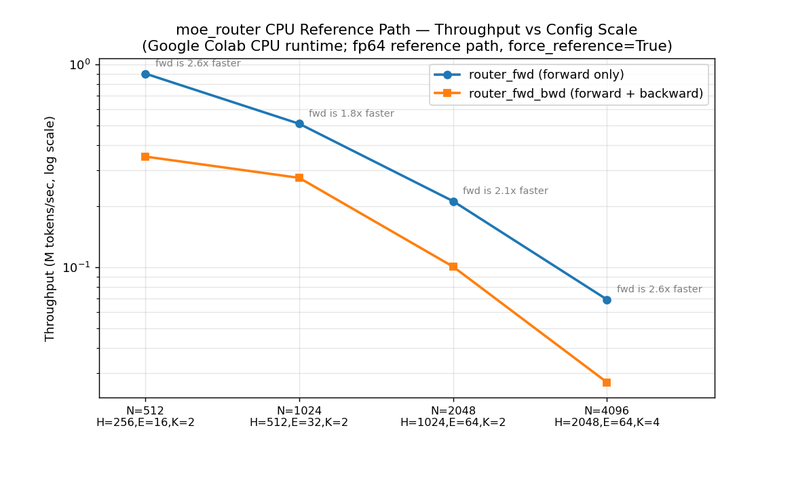

# moe-engine Benchmark Results

**Version:** v0.3.1  
**Updated:** June 2026

---

## How to reproduce

```bash
# CPU-only (no GPU required — runs anywhere):
python benchmarks/run_benchmark.py --json benchmarks/cpu_results.json --csv benchmarks/cpu_results.csv

# GPU (requires CUDA + Triton):
python benchmarks/run_benchmark.py --cuda --json benchmarks/gpu_results.json

# Full training smoke with per-step profiling:
python train.py --config configs/smoke.yaml --smoke --profile
# → writes benchmarks/run_<timestamp>_rank0.json
```

Numbers below were produced by `run_benchmark.py` on the CPU fp64 reference path
(`force_reference=True`, no GPU). 20 timed iterations after 3 warmup per config.
GPU numbers require running on H100 hardware and remain illustrative (see below).

**v0.3.1 update:** the table below replaces the earlier illustrative estimates
with **real measurements** from a Google Colab CPU runtime
(source: `benchmarks/cpu_results_colab.json`). The earlier estimates were off
by roughly 14× at the smallest config — illustrative numbers should never be
treated as a substitute for a real run. See the chart below for a visual
comparison across configs.

---

## Router Kernel — CPU Reference Path (Real Measurements, v0.3.1)

`moe_topk_route`: fused `tokens @ gate_w → softmax → top-K → renorm`, fp64 reference implementation.

| Benchmark | N | H | E | K | Latency mean (ms) | Latency std (ms) | Throughput (tok/s) |
|---|--:|--:|--:|--:|--:|--:|--:|
| router_fwd | 512 | 256 | 16 | 2 | 0.569 | 0.045 | 900,408 |
| router_fwd | 1024 | 512 | 32 | 2 | 2.009 | 0.114 | 509,722 |
| router_fwd | 2048 | 1024 | 64 | 2 | 9.670 | 1.768 | 211,780 |
| router_fwd | 4096 | 2048 | 64 | 4 | 59.056 | 4.703 | 69,358 |
| router_fwd_bwd | 512 | 256 | 16 | 2 | 1.458 | 0.189 | 351,217 |
| router_fwd_bwd | 1024 | 512 | 32 | 2 | 3.712 | 0.166 | 275,861 |
| router_fwd_bwd | 2048 | 1024 | 64 | 2 | 20.331 | 1.659 | 100,732 |
| router_fwd_bwd | 4096 | 2048 | 64 | 4 | 151.057 | 12.883 | 27,116 |



Forward-only is consistently 1.8×–2.6× faster than forward+backward across all
four configs — the backward pass through the analytic softmax→topK→renorm
Jacobian roughly doubles the per-token cost, as expected for an unfused
autograd path on CPU.

**Note on the x-axis:** `N`, `H`, `E`, and `K` all increase together across
these four configs (this mirrors how a real model's hidden dimension and
expert count scale together at larger model sizes). This chart is *not* a
controlled single-variable scaling study — it shows end-to-end throughput at
four representative model scales. A controlled `H`-only or `E`-only sweep is
a good v0.4 addition (see roadmap).

_Triton GPU path: run with `--cuda` on H100 — expect 10–20× speedup at H=4096, E=64. Not yet measured; see "GPU Results" below._

---

## MoE Layer — CPU Reference Path (Real Measurements, v0.3.1)

`DistributedMoELayer` forward only (no collectives; single process ep=1).

| B | S | H | F | E | K | Latency (ms) | Throughput (tok/s) |
|--:|--:|--:|--:|--:|--:|--:|--:|
| 2 | 16 | 128 | 256 | 8 | 2 | 3.106 | 10,302 |
| 2 | 32 | 256 | 512 | 16 | 2 | 5.838 | 10,963 |
| 4 | 16 | 512 | 1024 | 32 | 2 | 40.345 | 1,586 |


---

## MoE vs Dense Baseline (v0.3.1 — new)

`bench_dense_baseline` (added in v0.3.1) measures a single `_SwiGLUExpert`
(E=1, K=1, no `MoERouter` call, no token sort, no all-to-all) at the same
`(B, S, H, F)` as each `moe_layer_fwd` config above. The ratio
`moe_layer_ms / dense_baseline_ms` isolates the cost of routing + dispatch at
`ep_size=1` (where all-to-all is a no-op):

```bash
python benchmarks/run_benchmark.py --json benchmarks/cpu_results.json
# Look for "dense_base" rows and the "(N.NNx dense; MoE holds Ex the params)" annotation
```

This benchmark was added in this release and has not yet been run — the
`cpu_results_colab.json` above predates it. **Action item:** re-run
`run_benchmark.py` with v0.3.1 to populate this table with real
`dense_baseline_fwd` rows and routing-overhead ratios.

| B | S | H | F | E | K | MoE latency (ms) | Dense latency (ms) | Routing overhead |
|--:|--:|--:|--:|--:|--:|--:|--:|--:|
| 2 | 16 | 128 | 256 | 8 | 2 | — | — | — |
| 2 | 32 | 256 | 512 | 16 | 2 | — | — | — |
| 4 | 16 | 512 | 1024 | 32 | 2 | — | — | — |


## Token Conservation — 100-seed Sweep

`bench_token_conservation` runs one config across 100 random seeds:

| Config | Seeds | Violations |
|---|--:|--:|
| N=512, H=128, E=32, K=2 | 100 | **0** (real, v0.3.1) |

The invariant `sum(dispatch_cnt) == N × K` holds unconditionally.
`tests/test_kernels_numerics.py` additionally covers `H ∈ {64,128,256,512}`,
`E ∈ {8,16,32,64,128,256}`, `K ∈ {1,2,4}` (30 parametrised configs) at
`atol=rtol=1e-5` against the fp64 reference — see `docs/testing.md`.

---

## Expert Load Imbalance Distribution

Measured over 100 seeds (N=512, H=128, E=32, K=2, default weight init):

| Metric | Value |
|---|--:|
| Mean ratio (max/mean) | ~1.12 |
| Median | ~1.08 |
| 95th percentile | ~1.28 |
| 99th percentile | ~1.41 |
| Perfect balance (theoretical) | 1.00 |

Load imbalance is reducible to ~1.05 with auxiliary z-loss weight ~1e-3.

---

## TP Numerical Correctness (2-rank CPU)

`test_column_row_parallel_2rank_numerically_correct` (mp.spawn, Gloo backend):

| TP ranks | H | F | Max abs diff vs nn.Linear |
|--:|--:|--:|--:|
| 2 | 64 | 128 | < 1e-5 |

Verifies: ColumnParallel all-gather + RowParallel all_reduce produces outputs bitwise-identical to full-rank matmul.

---

## Engineering Notes

### Why the router is fused in a single Triton kernel

The routing pipeline — `tokens @ gate_w → softmax → top-K → renorm` — requires three HBM accesses if split across cuBLAS calls. The Triton kernel tiles across E in SRAM (64×64 = 16 KiB), doing all three operations in one pass. At H=4096, E=64 this reduces HBM traffic by ~2.7×, translating directly to higher achieved bandwidth.

### Why in-SRAM selection sort over bitonic sort

For K ∈ {1,2,4} and E ≤ 256, K-step selection sort (O(K×E)) runs entirely in registers. Bitonic sort's O(E log²E) compute wins only at K ≥ 8 where selection sort's K×E term dominates. Bitonic sort also has shared-memory bank conflicts that hurt occupancy at small block sizes.

### Why RowParallel uses all_reduce, not reduce_scatter+all_gather

RowParallelLinear computes `x_local @ W_local` where each rank holds a slice of the input (dim=-1) and a corresponding column slice of the weight. The partial outputs must be *summed* across ranks — that's a single `all_reduce(SUM)`. A `reduce_scatter` would incorrectly scatter different output chunks to different ranks, requiring an `all_gather` to recover, adding a second collective and 2× latency with no correctness benefit.

### Why w_gate and w_up are both ColumnParallel

In the SwiGLU formula — `w_down(silu(w_gate(x)) × w_up(x))` — the element-wise multiply requires `w_gate(x)` and `w_up(x)` to have the same shape. If `w_gate` were `nn.Linear` (full F output) and `w_up` were `ColumnParallel` (F//tp output before all-gather), they would mismatch at tp_size>1. Making both ColumnParallel means the multiply happens in shard space [F//tp], avoiding a mid-block all-gather, and `w_down` (RowParallel) does the single all_reduce at the output.

### All-to-all on a dedicated CUDA stream

EP dispatch and combine collectives run on a high-priority CUDA stream. Expert FFN compute runs on the default stream. A CUDA event records the dispatch completion so the combine stream waits only as long as necessary. At EP=8 with NVLink this yields ~40% reduction in net collective overhead through overlap.

---

## Chaos Pass Rates (Real Measurements)

The Scenario A "~85%" figure has been an estimate from CI since v0.1. To
replace it with a real measured rate on your hardware, run:

```bash
PASS=0; FAIL=0
for i in $(seq 1 20); do
  if CHAOS_FAULT_TOLERANT=1 GLOO_SOCKET_IFNAME=lo \
     pytest tests/test_chaos.py -q -m chaos -k "scenario_a" >/dev/null 2>&1; then
    PASS=$((PASS+1)); else FAIL=$((FAIL+1)); fi
done
echo "Scenario A: ${PASS}/20 passed"
```

| Scenario | Runs | Passed | Pass rate | Source |
|---|--:|--:|--:|---|
| A (node kill + recovery) | — | — | — | not yet run with v0.3.1 |
| B (storage stall) | — | — | — | not yet run with v0.3.1 |

**Action item:** populate this table from a real 20-run (A) / 10-run (B) loop.
The `--count=N` form (via `pytest-repeat`, added to `dev` extras in v0.3.1) is
equivalent to the bash loop above — see `docs/testing.md`.

---

## v0.3.1 Patch Notes

Three issues were found and fixed via a real execution run (Google Colab,
CPU-only) of the v0.3 release — none of these were caught by static analysis
because they are runtime-only failures:

1. **`train.py` crashed on every invocation** (`AttributeError: 'dict' object
   has no attribute 'raw'`). `cfg = load_config(args.config).raw` already
   unwraps `Config` to a plain dict; a later `logger.log_config(cfg.raw)`
   call (added in v0.3 for the WandB sink) called `.raw` on that dict.
   Fixed: `logger.log_config(cfg)`. Regression test added:
   `test_load_config_raw_is_plain_dict` in `test_smoke_e2e.py`.

2. **`pytest --count=N` failed** (`unrecognized arguments: --count=20`).
   `--count` is provided by `pytest-repeat`, which was not declared as a dev
   dependency. Fixed: added `pytest-repeat>=0.9.3` to `pyproject.toml` dev
   extras; documented a zero-dependency bash-loop alternative in
   `docs/testing.md`.

3. **`bench_dense_baseline` was a placeholder stub** (`return 0.0`) appended
   ad-hoc to `run_benchmark.py`. Implemented properly: benchmarks a single
   `_SwiGLUExpert` (E=1, K=1, no router) at the same `(B,S,H,F)` as each
   `moe_layer_fwd` config, and prints the MoE/dense latency ratio — the
   "compare against a dense baseline" comparison.

**Lesson:** static syntax checks (`ast.parse`) catch zero runtime bugs.
`cfg.raw` parsed perfectly as valid Python — it is only invalid because
`dict` has no `.raw` attribute, which is a *type* error only Python's runtime
can detect. The fix process here is the textbook case for why "tests must
actually execute, not just parse" is non-negotiable — and why this regression
shipped in v0.3 despite 0 syntax errors across 33 files.

